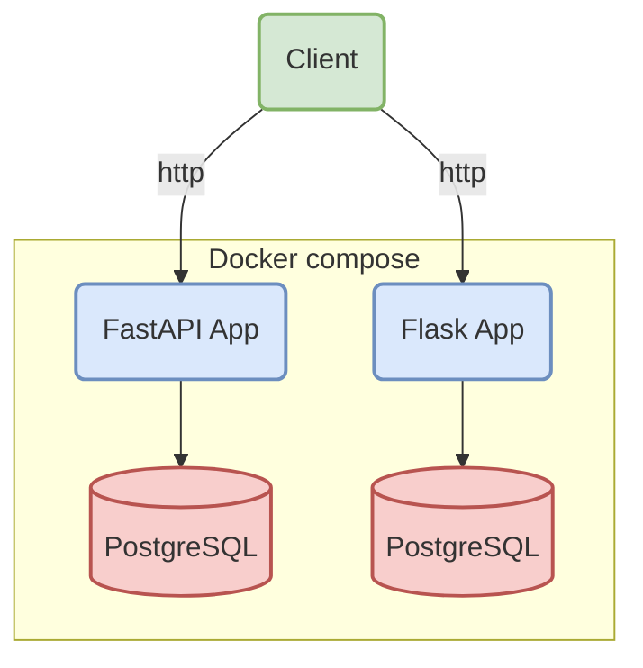

# FastAPI vs Flask Experiments

This experiment demonstrates:

- WIP

## Getting started

```bash
docker compose up --build
```

## Design


```mermaid
flowchart TB
    client(Client):::C
    subgraph Docker compose
        app1(FastAPI App):::A --> db1[(PostgreSQL)]:::D
        app2(Flask App):::A --> db2[(PostgreSQL)]:::D
    end

    client -- http --> app1 & app2

    classDef A fill:#DAE8FC,stroke:#6C8EBF,stroke-width:2px
    classDef D fill:#F8CECC,stroke:#B85450,stroke-width:2px
    classDef C fill:#D5E8D4,stroke:#82B366,stroke-width:2px
```
