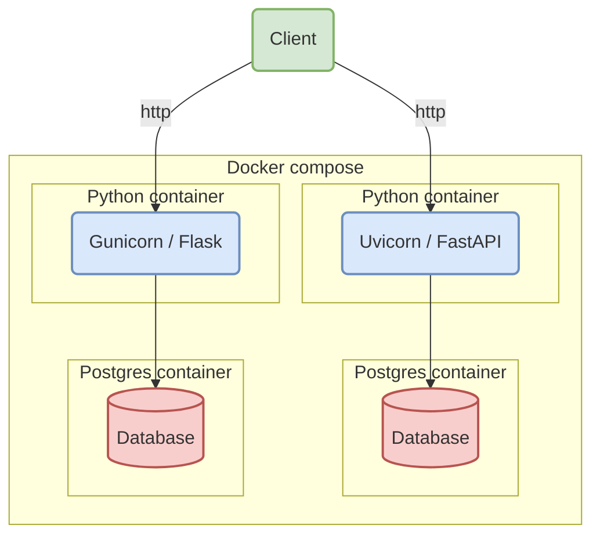

# FastAPI vs Flask Experiments

This experiment demonstrates:

- WIP

## Getting started

```bash
docker compose up --build
```

## Design



## Performance

### Test environment

| Dependency     | Version | Used by     |
|----------------|---------|-------------|
| Alembic        | 1.13.2  | Common      |
| Docker         | 27.1.1  | Common      |
| Docker Compose | 2.29.1  | Common      |
| Postgres       | 16.4    | Common      |
| Psycopg        | 3.2.1   | Common      |
| Python         | 3.12.4  | Common      |
| SQLAlchemy     | 2.0.31  | Common      |
| FastAPI        | 0.112.0 | FastAPI App |
| Pydantic       | 2.8.2   | FastAPI App |
| Starlette      | 0.37.2  | FastAPI App |
| Uvicorn        | 0.30.5  | FastAPI App |
| Flask          | 3.0.3   | Flask App   |
| Gunicorn       | 22.0.0  | Flask App   |
| Werkzeug       | 3.0.3   | Flask App   |
